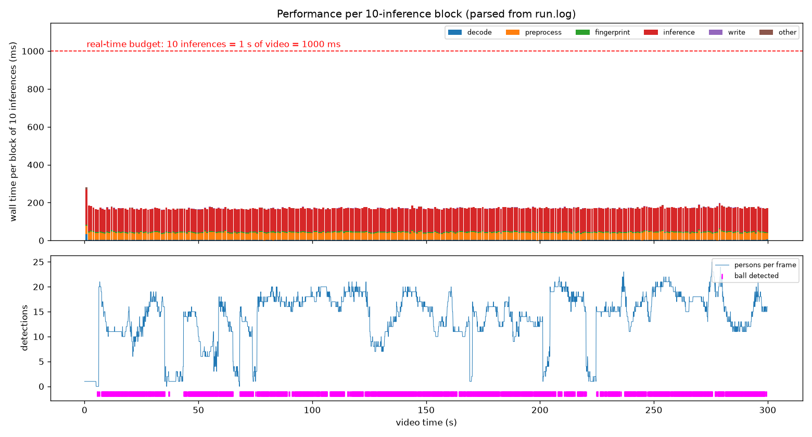

# vidinfer

Decode a video, run inference at **10 inferences per second of video**, on **RGB 720×1280** frames, and log
**performance every 10 inferences**, with results that are **verifiably reproducible**.

Model: person + ball detection (official Ultralytics YOLO26s weights, COCO classes `person` and `sports ball`).

## Results on `cut.mp4` (reference run, `results/reference/`)

| | |
|---|---|
| Input | H.264 1920×1080, 25 fps CFR, 7 500 frames, 300 s, untagged colour space |
| Inferences | **3 000 / 3 000 expected**, 7 500 / 7 500 frames decoded, 0 decode error |
| Throughput | **58.2 inferences/s = ×5.8 real time** (51.6 s for 300 s of video), slowest block ×3.6 |
| Latency per frame | p50 16.6 ms · p95 19.2 ms · p99 20.7 ms (excluding one-off model load 0.1 s and warm-up 2.7 s) |
| Where time goes | inference 72 % · preprocess 23 % · fingerprint 3 % · decode wait 2 % · write 0.5 % |
| GPU | RTX 4050 Laptop, peak 144 MiB allocated |
| Reproducibility | host run, host re-run and Docker run: **identical** `results_sha256` and `frames_crc32` |

Visuals in `results/reference/viz/`: a performance/detection timeline rebuilt from `run.log`, and 6 annotated frames
(wide shots, the standings overlay at t=90 s and a close-up at t=170 s as failure cases).



## Quick start

```bash
uv sync --locked                                              # exact environment from uv.lock
uv run python -m vidinfer data/cut.mp4 --output-dir outputs   # -> outputs/output.jsonl, outputs/run.log
uv run python -m vidinfer.viz outputs                         # -> outputs/viz/*.png|jpg
uv run pytest                                                 # 11 tests, CPU only, ~5 s, synthetic videos
```

Docker (GPU via the NVIDIA container toolkit; weights are baked in and verified at build time):

```bash
docker build --build-arg GIT_COMMIT=$(git rev-parse HEAD) -t vidinfer:0.1.0 .
docker run --rm --gpus all -v "$PWD/data:/data:ro" -v "$PWD/outputs:/work/outputs" vidinfer:0.1.0 /data/cut.mp4
```

Options: `--fps 10`, `--model yolo26s.pt|yolo26m.pt|path.pt`, `--device auto|cuda|cpu` (CPU fallback ≈ 2 inf/s),
`--max-frames N` (smoke test). Exit codes: `0` success, `2` invalid input (do not retry), `1` unexpected error.

## Requirement → implementation → proof

| Requirement | Implementation | Proof |
|---|---|---|
| Python program taking `cut.mp4` as argument | `python -m vidinfer VIDEO` | `tests/test_cli.py` (end to end on a synthetic video) |
| Resize to 720 (h) × 1280 (w) | one swscale call: YUV→RGB + resize, `AREA` (anti-aliased downscale); same 16:9 ratio, no distortion | contract checked on every frame (`check_rgb`) |
| Ensure RGB | `rgb24` by construction + contract; untagged HD → BT.709 matrix (libraries default to BT.601), logged as WARNING | pure-red video test: channel 0 is red |
| 10 inferences per second of video | timestamp sampler: nearest frame to `t0 + k/10`, tie → earlier frame, exact fractions | `3000/3000` in the summary; `test_sampler.py`; video whose frame index is written in its pixels |
| Log execution time every 10 frames | one logfmt `event=block` line per 10 inferences, with a per-stage breakdown | 300 block lines in `run.log`; parsed back in tests and in `viz` |
| Total execution time | `event=timing`: program wall, setup, model load, warm-up, processing wall, CPU time | `run.log` |
| Some video metadata | `event=video`: container, codec, profile, size, fps, time_base, duration, frames, bitrate, colour tags, sha256 | `run.log` + `output.jsonl` header |
| `output.<format>` for each frame | `output.jsonl`: header / one line per inferred frame (even with 0 detection) / summary | `results/reference/output.jsonl` (4.3 MB) |
| Images or a visualisation | `python -m vidinfer.viz`: timeline from `run.log` + annotated frames re-decoded and checked against `output.jsonl` | `results/reference/viz/` |

## Method

Every decision followed the same loop: **read the statement as a spec → look at the data before coding → list what
can be silently wrong → measure the options on the real video → decide with a stated rule → lock it with a test that
fails when the logic breaks → stop** (anything not required, not tested or not cheap goes to the roadmap, with the
condition that would bring it back).

| Decision | Options studied | Choice | Why |
|---|---|---|---|
| 25 → 10 fps | 1 frame out of N, float timestamps, ffmpeg `fps` filter, floor, nearest | nearest frame, tie → earlier, `Fraction`, grid anchored on the first PTS | 25/10 = 2.5: every odd target is an exact tie between two frames. Floats resolve ties by rounding noise; ffmpeg's default `fps=10` picks frames 1,3,6,8… (20–40 ms late). Nearest bounds the error to half a frame (20 ms). |
| Decoder | OpenCV, ffmpeg pipe, PyAV, torchcodec, NVDEC | PyAV, `thread_type="AUTO"` | exact PTS, RGB and colour matrix under control, lowest CPU; decoding every frame is mandatory anyway (H.264 P-frames) |
| Colour | trust library defaults / explicit | explicit BT.709 for untagged HD + WARNING | a pure red encoded BT.601 and decoded BT.709 comes back with G=23 instead of 0 (seen in the test suite) |
| Model boundary | pass RGB as-is / BGR view | BGR view at the Ultralytics call only | Ultralytics treats numpy input as BGR and flips it (`engine/predictor.py`); RGB as-is is a silent error |
| Model | YOLO26 n/s/m, imgsz 640/1280, FP16/32, RF-DETR | YOLO26s, imgsz 1280, FP16, conf 0.25 | smallest model not measurably worse on the ball (8–16 px at 720p needs imgsz 1280); m is one flag away |
| Loop | producer/consumer threads, batching | synchronous loop | ×5.8 real time already; decode runs in FFmpeg threads (0.27 ms/frame of wait) |
| Output | JSON, CSV, Parquet, COCO, MOT | JSON Lines | streamable, readable after a crash, keeps frames with 0 detection; the summary line marks completion |

## Reproducibility

Reproducibility is **verified, not assumed**: every run ends with two fingerprints.

- `results_sha256`: hash of `(source frame index, detections)` for every sample, timings excluded.
- `frames_crc32`: CRC of every pixel sent to the model (0.5 ms/frame, timed as its own stage). If results ever differ,
  it tells whether the drift comes from decoding/preprocessing or from the model.

| Run | Environment | results_sha256 | frames_crc32 |
|---|---|---|---|
| `results/reference` | host venv, Python 3.12.13, glibc 2.43 | `824865c8…a40a9c` | `0fb35010` |
| `results/rerun` | same host, second run | `824865c8…a40a9c` | `0fb35010` |
| `results/docker` | Docker image, Python 3.12.14, glibc 2.36 | `824865c8…a40a9c` | `0fb35010` |

What is pinned, and where it is recorded:

| Layer | Pinned by | Recorded in |
|---|---|---|
| Code | git commit (`-dirty` if modified) | `event=start`, output header |
| Python dependencies | `uv.lock` (versions + hashes; torch from the cu126 index) | `event=environment` (versions, CUDA, cuDNN, GPU, driver) |
| System image | base image by digest, uv by version | Dockerfile |
| Model weights | exact release URL + sha256, checked **before** loading (a `.pt` is a pickle); Docker `ADD --checksum` | `event=model`, output header |
| Input | sha256 of the video | `event=video`, output header |
| Parameters | argv + effective model parameters | output header |
| Runtime side effects | `YOLO_OFFLINE=1` (no telemetry, no online check), `YOLO_AUTOINSTALL=0` (no pip install mid-run) | — |
| Clean-machine rebuild | CI: `uv sync --locked` + lint + tests on every push | `.github/workflows/ci.yml` |

Ultralytics downloads weights from the *latest* GitHub release by default: this is why the URL is pinned.
Running the Docker image (not just building it) found two bugs before delivery: a remote `ADD` is created mode 600,
and `--chmod` also applied to the implicitly created parent directory (not traversable by the non-root user).

## Performance observability

Every log line is **logfmt**: readable by a human, parsable in one line of Python, no extra dependency.

```text
2026-09-24 15:07:47.709 INFO    event=block block=150 samples=1490-1499 video_t_s=149.90 wall_ms=165.52 ms_per_frame=16.55 inf_per_s=60.42 speed=6.04 decode_ms=2.52 preprocess_ms=34.47 fingerprint_ms=5.00 inference_ms=122.30 write_ms=0.96 other_ms=0.27 yolo_preprocess_ms=9.87 yolo_inference_ms=73.32 yolo_postprocess_ms=7.80 cpu_util=1.76 gpu_mem_mb=50.25 elapsed_s=25.60
```

- `speed` = seconds of video per second of wall time (the real-time SLO); a block with `speed < 1` logs a WARNING.
- Stages add up to `wall_ms`; `other_ms` is what is left unaccounted (loop overhead), so nothing is hidden.
- GPU stages are timed after `torch.cuda.synchronize()`: CUDA is asynchronous, without it you time the kernel launch.
- `yolo_*_ms` are Ultralytics' own timings, kept next to ours on purpose.
- `cpu_util` (CPU seconds / wall seconds) and `gpu_mem_mb` flag CPU-bound phases and memory leaks.

```python
import shlex
blocks = [dict(t.split("=", 1) for t in shlex.split(line.split(" event=block ", 1)[1]))
          for line in open("outputs/run.log") if " event=block " in line]
```

What the logs showed on this run:

1. Measured at our boundary, the model call costs **12.4 ms/frame**, while Ultralytics reports **9.1 ms**
   (1.0 preprocess + 7.3 network + 0.8 NMS): 3.3 ms per call are invisible in library timings. Measure at the boundary.
2. Decoding costs only **0.27 ms/frame of waiting**: FFmpeg threads decode concurrently (`cpu_util` ≈ 1.7 cores).
3. The first optimisation target would be **preprocessing (3.9 ms/frame, 23 %)**, a single-threaded swscale YUV→RGB
   + resize. Not needed at ×5.8 real time.

## Output format (`output.jsonl`)

```json
{"type":"header","schema_version":"1.0.0","program":{"git_commit":"bac08dc…"},"environment":{…},"video":{"sha256":"4072bd68…",…},"processing":{"target_fps":10,"yuv_matrix":"ITU709",…},"model":{"weights":"yolo26s.pt","sha256":"646f8bc3…",…},"coordinates":"bbox_xyxy in pixels of the 1280x720 frame"}
{"type":"frame","sample_index":2400,"source_frame_index":6000,"pts":3072000,"timestamp_s":240.0,"inference_ms":12.566,"detections":[{"bbox_xyxy":[628.0,537.0,641.0,550.0],"score":0.8081,"class_id":32,"class_name":"sports ball"},{"bbox_xyxy":[492.5,470.0,551.5,559.0],"score":0.8916,"class_id":0,"class_name":"person"},…]}
{"type":"summary","n_inferences":3000,"expected":3000,"processing_wall_s":51.561,"speed_x":5.82,"latency_ms":{…},"results_sha256":"824865c8…","frames_crc32":"0fb35010"}
```

A missing `summary` line means the run did not complete. Readers ignore unknown keys.

## Limitations

- **License**: Ultralytics is AGPL-3.0; production use needs an Enterprise license or an Apache-2.0 detector
  (RF-DETR was evaluated as a plan B during the study). The detector sits behind one class, so only the adapter would change.
- **Generic COCO detector**: 77 % of samples contain a `sports ball` detection at conf ≥ 0.25. This is not a recall
  measure: it includes spare balls near the pitch. Close-ups, replays and overlays give few or wrong detections (see
  `frame_t170.0s.jpg`); 13 frames have no detection at all (intro graphics).
- **BT.709 is an assumption** for this untagged HD stream (the usual convention); the matrix is logged and a tagged
  stream is always respected.
- Timings come from a laptop GPU and vary a little between runs (×5.82 reference, ×5.68 re-run and Docker);
  results do not (identical fingerprints).

## Deliberately not done (and what would bring it back)

| Not done | Why not now | Trigger |
|---|---|---|
| Threads / batching / NVDEC / TensorRT | ×5.8 real time; decode already overlaps inference | GPU idle > 30 %, multi-stream, cost at scale |
| Tracking, team assignment, pitch homography | not requested, no ground truth to evaluate them | annotated data and a product need |
| MLflow | no training here; lineage is already in the output header and summary | several runs to compare, or an existing tracking server |
| GPU tests in CI | hosted runners have no GPU; CI runs lint + the CPU test suite from `uv.lock` | self-hosted GPU runner |
| Parquet output | binary, unreadable after a crash | production volumes |

## Production roadmap (not implemented)

S3 input → one Step Functions execution per match → GPU job on EKS Spot (this image, pinned by digest, model version
resolved once) → outputs to S3 under a deterministic key (`match/model/commit`). The `summary` line makes retries
idempotent: present = skip, absent = rerun. Exit code 2 is never retried. Block metrics go to Prometheus/Grafana
(throughput, p95, `speed`); detections per frame, confidence and ball ratio per league and broadcaster serve as
label-free drift signals.

## Layout

```text
src/vidinfer/video.py     metadata, decode, timestamp sampler, RGB conversion + contract
src/vidinfer/model.py     pinned weights (URL + sha256), detector with the BGR boundary
src/vidinfer/__main__.py  CLI, loop, stage timers, logfmt logging, output.jsonl, fingerprints
src/vidinfer/viz.py       timeline parsed from run.log, annotated frames
tests/                    sampler, pixels/RGB, model boundary, end to end (synthetic videos)
results/                  reference run (+ re-run and Docker logs for the reproducibility check)
```
